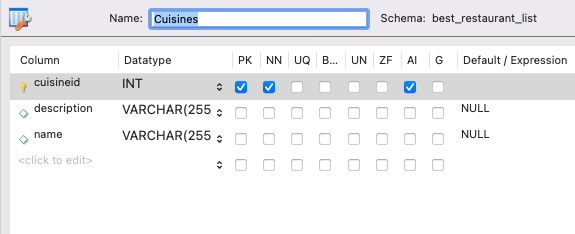
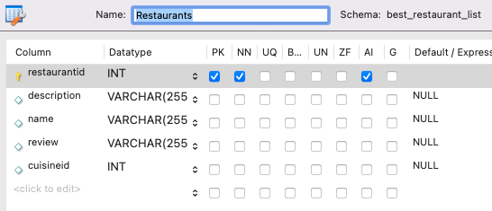

# Best Restaurant

### Contributors
  * Athea DeLing
  * Greg Ramsower

### Description
This is an application that allows you to add and remove different types of cuisines. From there the application also allows you to add and remove different restaurants which you then connect to each individual cuisine. To be able to do that you have to have at least one cuisine added already. This application uses a SQL data base to hold all the information.

### Technologies Used
  * C#
  * .NET 6 SDK
  * SQL
  * HTML
  * CSS

### Setup Instructions
#### .NET, MySQL, and Setting up the Database
1. Install .NET if you have not done so already. Visit [this link](https://dotnet.microsoft.com/en-us/download/dotnet/6.0) to download the recommended versions of both software packages.
2. Follow the installer prompts to install the software. Use the default settings.
3. In a terminal, install `dotnet-script` by entering the following command: `$ dotnet tool install -g dotnet-script`. You will also need to configure your environment to access this tool. See [this link](https://www.learnhowtoprogram.com/c-and-net/getting-started-with-c/installing-dotnet-script).
4. Install MySQL.  Follow the instructions at [this link](https://www.learnhowtoprogram.com/c-and-net/getting-started-with-c/installing-and-configuring-mysql).
5. Create a database following the instructions [located here]((https://www.learnhowtoprogram.com/lessons/creating-a-test-database-exporting-and-importing-databases-with-mysql-workbench).
  * Note: The database for this project should have two (2) tables. 
  * The first should be named `Cuisines` and should have three columns named cuisineid, description, and name as shown in the screenshot below:
 

  * The second table should be named `Restaurants` and should have five columns named restaurantid, description, name, review, and cuisineid, with the applicable characteristics as shown in the screenshot below:
  

#### Running the Program
1. Clone this repository.
2. Open the terminal and navigate to this project's production directory called "BestRestaurant".
3. Within the production directory "BestRestaurant", create a new file called appsettings.json.
4. Within appsettings.json, add the following code, replacing the `uid` and `pwd` values with your own username and password for MySQL.

```json
{
  "ConnectionStrings": {
      "DefaultConnection": "Server=localhost;Port=3306;database=best_restaurant_list;uid=[uid];pwd=[pwd];"
  }
}
```

5. Within the production directory "BestRestaurant", run `dotnet watch run` in the command line to start the project in development mode with a watcher.
6. Open the browser to _https:localhost:5001_. 
  * If you cannot access localhost:5001, it is likely because you have not configured a .NET developer security certificate for HTTPS. (Please see [this page](https://www.learnhowtoprogram.com/c-and-net-part-time/c-web-applications/redirecting-to-https-and-issuing-a-security-certificate) for instructions on how to fix this issue. 

### Known Bugs
  * No known bugs currently
  
### License
[GNU GPL 3.0](https://choosealicense.com/licenses/gpl-3.0/) Copyright (c) 12/18/2022 Athea DeLing, Greg Ramsower
